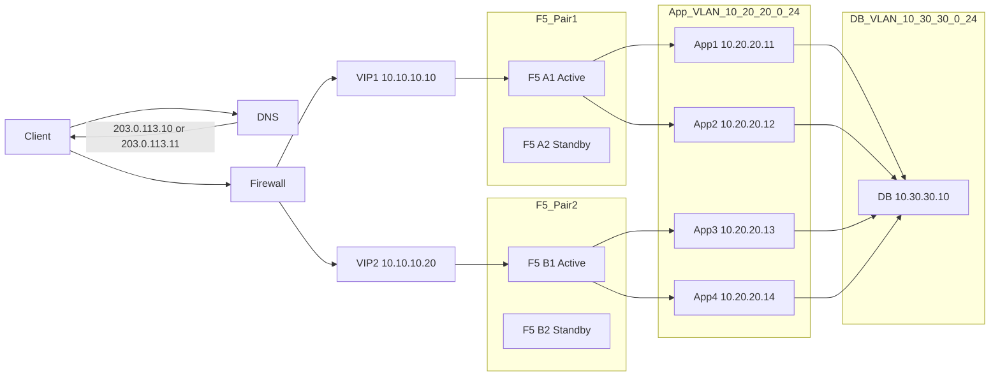
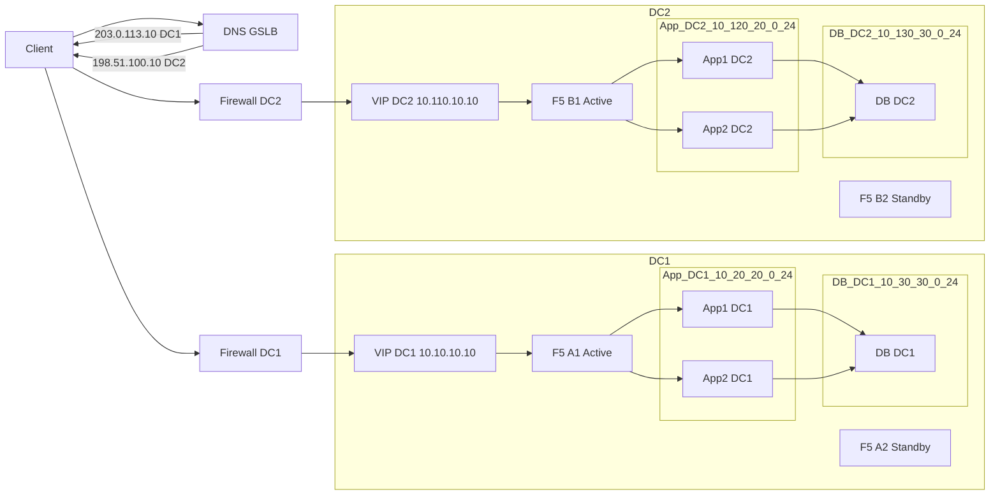
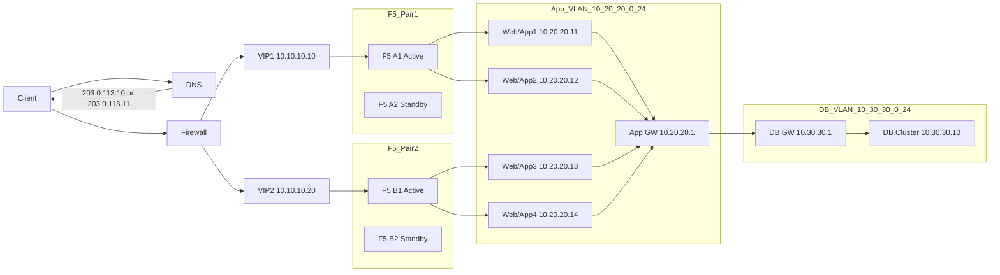
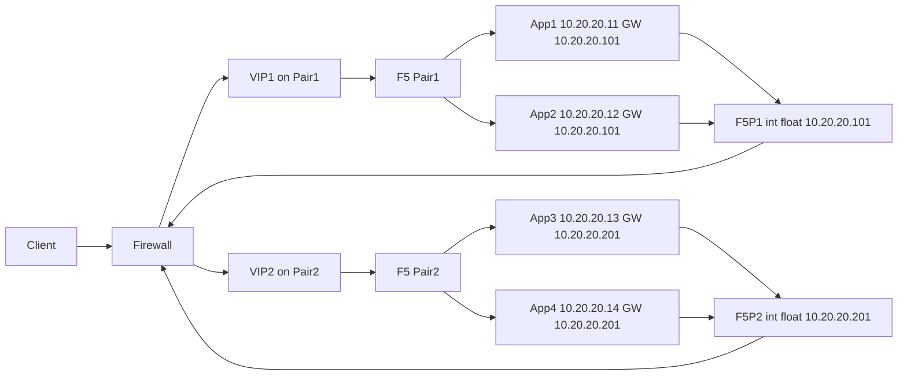

```mermaid
flowchart LR

    Client[Client] --> DNS[DNS]
    DNS -->|203.0.113.10 or 203.0.113.11| Client

    Client --> FW[Firewall]

    FW --> VIP1[VIP1 10.10.10.10]
    FW --> VIP2[VIP2 10.10.10.20]

    subgraph F5_Pair1
        A1[F5 A1 Active]
        A2[F5 A2 Standby]
    end

    subgraph F5_Pair2
        B1[F5 B1 Active]
        B2[F5 B2 Standby]
    end

    VIP1 --> A1
    VIP2 --> B1

    subgraph App_VLAN_10_20_20_0_24
        APP1[App1 10.20.20.11]
        APP2[App2 10.20.20.12]
        APP3[App3 10.20.20.13]
        APP4[App4 10.20.20.14]
    end

    subgraph DB_VLAN_10_30_30_0_24
        DB[DB 10.30.30.10]
    end

    A1 --> APP1
    A1 --> APP2
    B1 --> APP3
    B1 --> APP4

    APP1 --> DB
    APP2 --> DB
    APP3 --> DB
    APP4 --> DB
```

```mermaid
flowchart LR

    Client[Client] --> DNS[DNS GSLB]
    DNS -->|203.0.113.10 DC1| Client
    DNS -->|198.51.100.10 DC2| Client

    Client --> FW1[Firewall DC1]
    Client --> FW2[Firewall DC2]

    FW1 --> VIP1_DC1[VIP DC1 10.10.10.10]
    FW2 --> VIP1_DC2[VIP DC2 10.110.10.10]

    subgraph DC1
        A1[F5 A1 Active]
        A2[F5 A2 Standby]
        VIP1_DC1 --> A1
        subgraph App_DC1_10_20_20_0_24
            APP1_DC1[App1 DC1]
            APP2_DC1[App2 DC1]
        end
        subgraph DB_DC1_10_30_30_0_24
            DB1[DB DC1]
        end
        A1 --> APP1_DC1
        A1 --> APP2_DC1
        APP1_DC1 --> DB1
        APP2_DC1 --> DB1
    end

    subgraph DC2
        B1[F5 B1 Active]
        B2[F5 B2 Standby]
        VIP1_DC2 --> B1
        subgraph App_DC2_10_120_20_0_24
            APP1_DC2[App1 DC2]
            APP2_DC2[App2 DC2]
        end
        subgraph DB_DC2_10_130_30_0_24
            DB2[DB DC2]
        end
        B1 --> APP1_DC2
        B1 --> APP2_DC2
        APP1_DC2 --> DB2
        APP2_DC2 --> DB2
    end
```

```mermaid
flowchart LR

    Client[Client] --> DNS[DNS]
    DNS -->|203.0.113.10 or 203.0.113.11| Client

    Client --> FW[Firewall]

    FW --> VIP1[VIP1 10.10.10.10]
    FW --> VIP2[VIP2 10.10.10.20]

    subgraph F5_Pair1
        A1[F5 A1 Active]
        A2[F5 A2 Standby]
    end

    subgraph F5_Pair2
        B1[F5 B1 Active]
        B2[F5 B2 Standby]
    end

    VIP1 --> A1
    VIP2 --> B1

    %% App VLAN with default gateway
    subgraph App_VLAN_10_20_20_0_24
        APP_GW[App GW 10.20.20.1]
        APP1[Web/App1 10.20.20.11]
        APP2[Web/App2 10.20.20.12]
        APP3[Web/App3 10.20.20.13]
        APP4[Web/App4 10.20.20.14]
    end

    %% DB VLAN with default gateway
    subgraph DB_VLAN_10_30_30_0_24
        DB_GW[DB GW 10.30.30.1]
        DB[DB Cluster 10.30.30.10]
    end

    %% F5 to webservers (HTTPS, SNAT)
    A1 --> APP1
    A1 --> APP2
    B1 --> APP3
    B1 --> APP4

    %% Webservers use App GW as default gateway
    APP1 --> APP_GW
    APP2 --> APP_GW
    APP3 --> APP_GW
    APP4 --> APP_GW

    %% Routing between App GW and DB GW, then DB
    APP_GW --> DB_GW
    DB_GW --> DB
```

```mermaid
flowchart LR
Client["Client"] --> FW["Firewall"]

FW --> VIP1["VIP1 on Pair1"]
FW --> VIP2["VIP2 on Pair2"]

VIP1 --> F5P1["F5 Pair1"]
VIP2 --> F5P2["F5 Pair2"]

F5P1 --> APP1["App1 10.20.20.11 GW 10.20.20.101"]
F5P1 --> APP2["App2 10.20.20.12 GW 10.20.20.101"]

F5P2 --> APP3["App3 10.20.20.13 GW 10.20.20.201"]
F5P2 --> APP4["App4 10.20.20.14 GW 10.20.20.201"]

APP1 --> F5P1_INT["F5P1 int float 10.20.20.101"]
APP2 --> F5P1_INT

APP3 --> F5P2_INT["F5P2 int float 10.20.20.201"]
APP4 --> F5P2_INT

F5P1_INT --> FW
F5P2_INT --> FW
```

