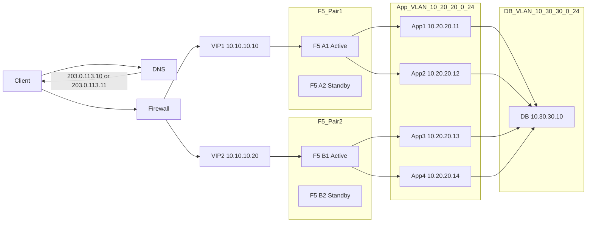
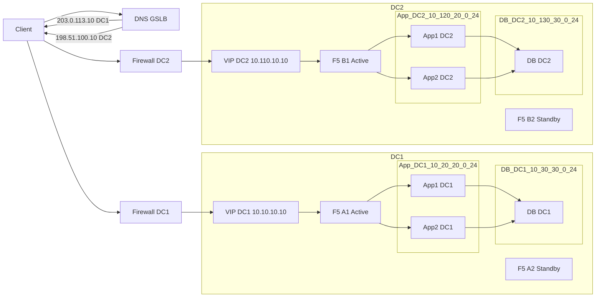
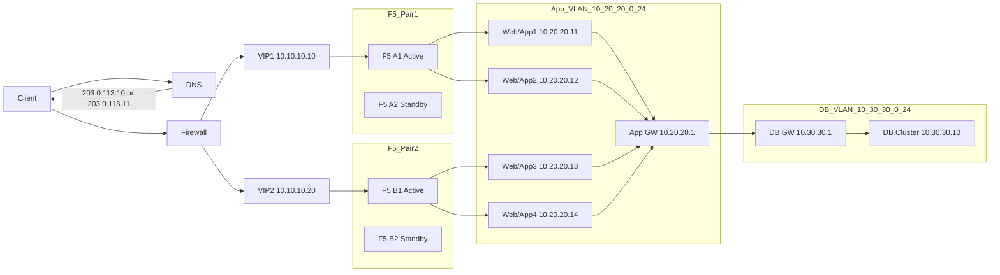
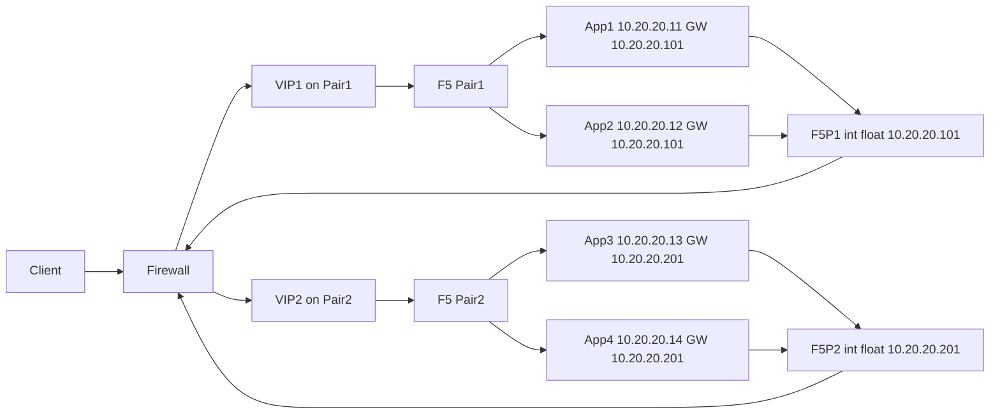

# Enterprise F5 BIG-IP LTM High Availability Architecture for Financial Services

## Executive summary: Proven dual-tier design ensures 99.999% uptime

**The recommended architecture deploys independent active-standby F5 LTM pairs in each data center, orchestrated by F5 BIG-IP DNS for intelligent global traffic distribution**. This proven pattern delivers sub-second local failover, eliminates cross-datacenter synchronization complexity, and provides clear failure domains essential for financial services. For session continuity, implement encrypted cookie persistence with AES-192 and application-layer session replication via Redis. End-to-end TLS 1.3 encryption with SSL offload at F5 enables deep traffic inspection while maintaining zero-trust security through re-encryption to backends. This architecture scales horizontally via ECMP routing across multiple F5 pairs, supports 3x growth capacity, and meets PCI-DSS v4.0.1 and SOC 2 Type II requirements.

**Why this matters**: Financial institutions require architectures that balance extreme availability (five nines), regulatory compliance, and operational simplicity. The dual-tier design separates concerns—local HA pairs handle device failures in seconds, while DNS-based GSLB manages datacenter failures in minutes—creating resilient infrastructure without the operational burden of stretched Layer 2 clusters. The SSL orchestration layer provides visibility into encrypted traffic for fraud detection and DLP while maintaining end-to-end encryption mandated by regulations.

**Critical context**: Traditional stretched HA clusters across datacenters introduce split-brain risks, latency sensitivity, and complex failure scenarios. The independent-pairs-plus-DNS pattern has become the de facto standard for enterprises requiring geographic redundancy, validated through thousands of financial services deployments globally. This architecture accommodates data sovereignty requirements, enables active-active utilization of all hardware, and simplifies disaster recovery testing.

---

## Architecture overview: Independent HA pairs with DNS orchestration

### Single datacenter HA architecture

The foundational building block deploys **two F5 BIG-IP LTM devices in active-standby configuration** within a single datacenter. The active device processes all traffic while the standby maintains synchronized configuration and mirrors critical connection state. This three-arm topology separates external client traffic, internal server traffic, and HA control plane communications onto dedicated VLANs. Device Service Clustering (DSC) provides certificate-based trust, automatic configuration synchronization, and sub-second failover detection through multiple heartbeat mechanisms including network failover (UDP 1026), VLAN failsafe monitoring, and gateway pool health checks.

**Network topology**: The external VLAN (VLAN 100, 172.16.10.0/24) connects to upstream internet routers and hosts the floating virtual IP addresses that clients access. The internal VLAN (VLAN 200, 192.168.10.0/24) connects to application server pools and provides the default gateway for backend systems. The dedicated HA VLAN (VLAN 300, 10.10.202.0/30) carries ConfigSync traffic (TCP 4353), failover heartbeats (UDP 1026), connection mirroring (TCP 1029+), and management traffic. Each device maintains non-floating self-IPs on all VLANs plus floating self-IPs on external and internal VLANs that migrate during failover events.

**Failover behavior**: When the active device experiences hardware failure, interface loss, or daemon crashes, the standby detects the failure within 3-10 seconds depending on the trigger mechanism. The standby promotes itself to active status, assumes ownership of all floating IP addresses, sends gratuitous ARP packets to update switch MAC address tables, and begins processing traffic. Because connection state and persistence records were mirrored continuously, existing sessions continue without interruption for long-lived connections. Short HTTP sessions may require re-authentication but transaction integrity remains intact. Total failover time ranges from sub-second (hardware cable detection) to 5-10 seconds (gateway failsafe detection).

### Multi-datacenter active-active architecture

The enterprise architecture **deploys independent active-standby HA pairs in each geographic location** (primary datacenter, disaster recovery datacenter, and optional edge sites) with **F5 BIG-IP DNS providing intelligent global server load balancing**. Each datacenter operates autonomously with its own HA pair, processing traffic locally for optimal latency. F5 BIG-IP DNS monitors application health across all sites via encrypted iQuery protocol (TCP 4353), making real-time routing decisions based on topology (geographic proximity), performance metrics (response time, connection counts), and availability (health monitor status).

**Geographic traffic distribution**: Clients resolve application FQDNs through F5 BIG-IP DNS, which returns VIP addresses from the optimal datacenter based on configurable policies. Topology-based routing directs North American users to the East Coast datacenter, European users to the London datacenter, and Asian users to the Singapore datacenter, minimizing latency. Dynamic load balancing methods (Least Connections, Fastest Response) distribute load during normal operations and automatically fail over to surviving sites during datacenter outages. DNS persistence based on source IP subnet ensures subsequent requests from the same client return to the same datacenter for session affinity.

**Session state management**: Because LTM HA pairs across datacenters do NOT synchronize connection state or persistence records (this is architecturally intentional), the application layer must handle session persistence. The recommended pattern implements **external session stores** using Redis Cluster or Memcached Cluster with cross-datacenter replication. F5 LTM uses encrypted cookie persistence (cookie name consistent across sites) to maintain affinity to a specific backend server within a datacenter, while DNS persistence maintains affinity to a datacenter, and the application replicates session data across Redis instances in all locations. This separation of concerns provides the highest availability—if a user's primary datacenter fails, DNS redirects to the DR site where the application retrieves session state from the replicated Redis cluster.

**Configuration synchronization**: Each HA pair maintains its own Device Service Clustering configuration with automatic ConfigSync within the pair. Across datacenters, configurations are managed centrally via **F5 BIG-IQ** or infrastructure-as-code tools (Ansible, Terraform). BIG-IQ provides a single pane of glass for configuration deployment, uses templates with datacenter-specific variables (IP addresses, pool members), enforces policy compliance, and maintains audit trails required for SOC 2. The GitOps workflow stores configurations in version control with approval gates, automated validation, and rollback capabilities essential for financial services change management.

---

## SSL/TLS end-to-end encryption: Offload, inspect, and re-encrypt

### Traffic flow and SSL orchestration

The complete SSL/TLS flow demonstrates zero-trust security principles: **Client → TLS 1.3 connection → F5 VIP → SSL offload (Client SSL profile) → Cleartext inspection → SSL re-encryption (Server SSL profile) → Backend application servers → Reverse flow**. This dual-profile architecture provides full visibility into encrypted traffic for fraud detection, data loss prevention, and security analytics while maintaining encryption at all points on the wire.

When a client initiates a connection to https://api.bank.com (resolving to F5 VIP 172.16.10.100:443), the F5 virtual server with Client SSL profile attached performs the TLS handshake. F5 presents its client-facing certificate (issued by public CA DigiCert with CN=*.bank.com), negotiates cipher suites, and decrypts the incoming request. The decrypted HTTP request flows through F5's traffic management microkernel (TMM) where iRules execute, security policies apply, load balancing algorithms select pool members, and HTTP headers are inserted (X-Forwarded-For, X-Forwarded-Proto). F5 then initiates a separate TLS connection to the selected backend server using the Server SSL profile, re-encrypting the request before transmission. Backend servers decrypt requests, process transactions, and return encrypted responses that F5 decrypts, inspects, and re-encrypts to clients.

**Certificate architecture**: The client-facing certificate uses RSA 4096-bit or ECDSA P-256 keys issued by a public certificate authority (DigiCert, Let's Encrypt, Sectigo) with validity typically 90-397 days per CA/Browser Forum baseline requirements. This certificate must include the complete chain (leaf certificate → intermediate CA → root CA) in the Client SSL profile's certificate key chain property. Backend certificates can be issued by internal PKI, use longer validity periods (1-3 years), and employ 2048-bit RSA keys sufficient for internal communications. If backend servers require mutual TLS authentication, configure F5 to present a client certificate in the Server SSL profile.

### Client SSL profile configuration

The Client SSL profile terminates external TLS connections and enforces strong cryptographic standards:

```
Profile Name: fintech_clientssl
Parent Profile: clientssl
Certificate Key Chain:
  - Certificate: /Common/wildcard-bank-com-2024.crt
  - Key: /Common/wildcard-bank-com-2024.key
  - Chain: /Common/digicert-intermediate-bundle.crt
Cipher Group: /Common/fintech_secure_ciphers
Options to Enable:
  - No SSLv2
  - No SSLv3
  - No TLSv1.0  
  - No TLSv1.1
Secure Renegotiation: Require
Server Name (SNI): Enabled
OCSP Stapling: Enabled
Session Ticket: Enabled
Cache Size: 262144
Cache Timeout: 3600
```

**Cipher group for 2025 fintech deployments**: Create a cipher group enforcing TLS 1.2 and TLS 1.3 with forward secrecy. The recommended suite prioritizes AES-GCM authenticated encryption and ChaCha20-Poly1305 for mobile clients:

```
Cipher Group Name: fintech_secure_ciphers
Allow Rules:
TLS13-AES256-GCM-SHA384
TLS13-AES128-GCM-SHA256
TLS13-CHACHA20-POLY1305-SHA256
ECDHE-RSA-AES256-GCM-SHA384
ECDHE-RSA-AES128-GCM-SHA256
ECDHE-ECDSA-AES256-GCM-SHA384
ECDHE-ECDSA-AES128-GCM-SHA256
ECDHE-ECDSA-CHACHA20-POLY1305-SHA256
ECDHE-RSA-CHACHA20-POLY1305-SHA256
Exclude: RC4, 3DES, MD5, EXPORT, DES, CBC-mode (if no legacy support needed)
```

This cipher configuration achieves A+ ratings on SSL Labs tests, meets PCI-DSS requirements for strong cryptography, and provides Perfect Forward Secrecy (PFS) essential for protecting past communications if keys are compromised. TLS 1.3 reduces handshake latency from 2-RTT to 1-RTT, improving performance for high-frequency trading platforms.

### Server SSL profile configuration

The Server SSL profile re-encrypts traffic to backend servers and optionally validates backend certificates:

```
Profile Name: fintech_serverssl
Parent Profile: serverssl
Certificate: /Common/f5-to-backend-client-cert.crt (only if backends require mutual TLS)
Key: /Common/f5-to-backend-client-cert.key
Chain: /Common/internal-ca-bundle.crt
Server Authentication: Require (validates backend certificates against trusted CAs)
Trusted Certificate Authorities: /Common/internal-ca-bundle.crt
Cipher Group: /Common/backend_secure_ciphers
Secure Renegotiation: Require Strict
```

For internal communications, backend cipher requirements can be slightly relaxed while maintaining security. If backends only support TLS 1.2, configure the Server SSL profile accordingly while keeping TLS 1.3 on the client side. **Server authentication should be set to "Require" in production fintech environments** to prevent man-in-the-middle attacks and ensure backend server identity validation.

### Traffic inspection capabilities

Between SSL offload and re-encryption, F5 operates on cleartext traffic enabling sophisticated security and routing logic:

**HTTP header manipulation** inserts forensic headers for backend applications (X-Forwarded-For, X-Forwarded-Proto, X-SSL-Cipher) and adds security headers to responses (Strict-Transport-Security, Content-Security-Policy, X-Frame-Options). **Client certificate inspection** extracts subject distinguished names, validates certificate chains, and routes based on organizational unit or serial number for certificate-based authentication. **Content inspection** enables data loss prevention (DLP) by scanning for credit card numbers, social security numbers, or API keys in cleartext before re-encryption. **Advanced routing** makes load balancing decisions based on URI paths, HTTP methods, request headers, or cookie values. **Integration with security ecosystem** allows insertion of transparent proxies, IDS/IPS inspection, or CASB solutions in the cleartext flow.

---

## Session persistence: Encrypted cookies with stateful failover

### Cookie persistence configuration

For HTTP/HTTPS applications, **HTTP cookie insert with AES-192 encryption** provides the optimal balance of security, performance, and transparency. F5 inserts a persistence cookie in the server's HTTP response containing an encrypted reference to the selected pool member. Subsequent requests from the same client include this cookie, directing F5 to route traffic to the same backend server throughout the session lifetime.

**Production persistence profile**:

```
Profile Name: fintech_cookie_persist
Cookie Method: insert
Cookie Name: SecureFinTechSession (custom name avoids information disclosure)
Cookie Encryption: required
Cookie Encryption Passphrase: <strong-passphrase-minimum-16-characters>
Encrypt Cookie Pool Name: yes (prevents revealing pool names)
Expiration: 0:0:0 (session cookie, deleted when browser closes)
Timeout: 900 seconds (15 minutes for financial transaction sessions)
Match Across Services: enabled
Match Across Pools: disabled (security isolation)
Mirror: enabled (replicates persistence records to standby)
```

**Security rationale**: Default F5 cookie format `BIGipServer<pool_name>=<encoded_ip>.<encoded_port>` leaks infrastructure information including F5 presence, pool names, and backend IP addresses. CISA security advisory (October 2024) recommends encrypting all persistence cookies in production environments. The encrypted cookie format uses AES-192 cipher with the configured passphrase, rendering the cookie opaque to attackers and preventing information leakage or cookie spoofing attempts.

**HTTP profile enhancement** adds additional encryption layer and security attributes:

```
Profile Name: fintech_http_profile
Parent: http
Encrypt Cookies: SecureFinTechSession
Encrypt Cookie Secret: <separate-encryption-key>
Insert X-Forwarded-For: enabled
Header Insert: "Strict-Transport-Security: max-age=31536000; includeSubDomains; preload"
```

Applying both the cookie persistence profile and HTTP profile to the virtual server provides defense-in-depth through dual encryption and adds HSTS headers for HTTPS enforcement.

### Fallback persistence and HA considerations

**Fallback persistence** handles scenarios where cookies are blocked, deleted, or unavailable:

```
Virtual Server Configuration:
Default Persistence: fintech_cookie_persist
Fallback Persistence: source_addr
Fallback Timeout: 300 seconds
```

Source address persistence provides backup session affinity based on client IP address when cookies fail. The 5-minute timeout balances session continuity with resource consumption on F5.

**Persistence mirroring** replicates persistence records from active to standby device over the HA VLAN (TCP port 1028). When failover occurs, the new active device already possesses the persistence table and continues routing clients to their established backend servers. Enable mirroring in the persistence profile (mirror: enabled) and configure primary and secondary mirror addresses on each device (Device Management → Devices → [self] → Mirroring → Primary: 10.10.202.98).

**Connection mirroring** replicates Layer 4 connection state for long-lived financial transactions. Enable per virtual server for specific applications requiring zero-disruption failover:

```
Virtual Server: fintech_trading_platform
Connection Mirroring: enabled
Mirror: enabled
```

Connection mirroring incurs performance overhead (approximately 10-15%) due to continuous state synchronization. Enable only for critical long-lived connections (trading platforms, WebSocket sessions) and disable for high-volume short-lived HTTP transactions where re-authentication is acceptable.

### Health monitoring with rapid failover

**Application-layer health monitoring** detects backend failures faster and more accurately than simple TCP port checks:

```
Monitor Name: fintech_https_monitor
Type: https
Interval: 5 seconds
Timeout: 16 seconds (3 × interval + 1)
Send String: "GET /health HTTP/1.1\r\nHost: api.bank.internal\r\nConnection: Close\r\n\r\n"
Receive String: "\"status\":\"healthy\""
Receive Disable String: "\"status\":\"maintenance\"|503|500"
```

This monitor establishes HTTPS connections every 5 seconds, validating both SSL handshake success and application health endpoint response. The 16-second timeout allows 3 consecutive failures before marking a pool member down (total detection time: 16 seconds). The Receive Disable String immediately marks members down on maintenance mode without waiting for timeout.

**Advanced health monitoring** for multi-tier applications:

```
Monitor Name: fintech_deep_health_check
Type: https
Interval: 10 seconds
Timeout: 31 seconds
Send String: "POST /api/v1/healthcheck/deep HTTP/1.1\r\nHost: api.bank.internal\r\nContent-Type: application/json\r\nContent-Length: 15\r\n\r\n{\"check\":\"all\"}"
Receive String: "\"database\":\"connected\",\"redis\":\"connected\",\"mq\":\"connected\""
```

This deep health check validates database connectivity, cache availability, and message queue status, ensuring backend servers are fully operational before receiving production traffic.

**Gateway pool monitoring** detects network path failures:

```
Pool Name: gateway_monitor_pool
Members: 
  - 172.16.10.1:80 (upstream internet router)
  - 172.16.10.2:80 (redundant router)
Monitor: gateway_icmp
Configuration:
System → High Availability → Fail-safe → Gateway Fail-safe → Create
Pool: gateway_monitor_pool
Minimum Available Members: 1
Action: Failover
Interval: 1 second
Timeout: 5 seconds
```

If both gateway routers become unreachable (network partition), the device triggers failover even though the HA heartbeat remains operational. This prevents the active device from processing traffic when isolated from the internet.

---

## High availability mechanisms: Sub-second failover with stateful resilience

### Device Service Clustering architecture

F5's Device Service Clustering (DSC) creates trusted relationships between BIG-IP devices for configuration synchronization and traffic group failover. The architecture consists of four layers: **Device Trust Domain** establishes certificate-based mutual authentication between devices; **Device Groups** define which configurations synchronize (sync-failover groups or sync-only groups); **Traffic Groups** bundle floating IP addresses and virtual servers that fail over as atomic units; **Failover Methods** detect failures and initiate failover events.

**Configuration workflow**:

1. **Establish device trust** (one-time setup per pair):
```
Device Management → Device Trust → Device Trust Members → Add
Device IP Address: 192.168.10.71 (peer's management IP)
Administrator Username: admin
Administrator Password: <peer-admin-password>
```
This exchange cryptographic certificates, establishing bidirectional trust. Each device verifies the peer's identity before accepting configuration sync or failover commands.

2. **Configure sync and failover addresses** (per device):
```
Device Management → Devices → bigip01.fintech.local → Device Connectivity
ConfigSync → Local Address: 192.168.10.70 (internal VLAN non-floating self-IP)
Failover → Unicast Configuration:
  - Address: 10.10.202.98 (HA VLAN self-IP, primary)
  - Address: 10.10.200.98 (management IP, secondary)
Mirroring → Primary: 10.10.202.98, Secondary: 192.168.10.70
```

3. **Create device group** (created once, syncs to all members):
```
Device Management → Device Groups → Create
Name: fintech_sync_failover_group
Group Type: Sync-Failover
Members: bigip01.fintech.local, bigip02.fintech.local
Network Failover: Enabled
Sync Method: Manual with Incremental Sync
```

4. **Initial configuration synchronization**:
```
Device Management → Overview → Sync Device to Group (from authoritative device)
```

### Failover detection mechanisms

**Network failover heartbeat** (UDP port 1026) sends continuous packets between devices on configured unicast addresses. Loss of heartbeat for the configured timeout period (default 3 seconds) triggers failover. Configure multiple addresses (HA VLAN + management) to prevent false failovers during single link failures.

**VLAN failsafe** monitors traffic on production VLANs and initiates ICMP probes if no traffic detected:
```
System → High Availability → Fail-safe → VLANs → Create
VLAN: external
Timeout: 10 seconds (requires PortFast enabled on switches)
Action: Failover
```

**Gateway failsafe pool** actively monitors upstream routers:
```
Interval: 1 second
Timeout: 5 seconds  
Minimum Available Members: 1
Action: Failover (if threshold breached)
```

**HA Groups** aggregate multiple health indicators (trunks, pools, routes) into weighted scores:
```
System → High Availability → HA Groups → Create
Name: fintech_ha_score
Pool: backend_production_pool (weight: 20)
Trunk: trunk1 (weight: 15)
Minimum Active Members: 2
Active Bonus: 10 (prevents flapping)
Threshold: 40
```
When a device's HA score drops below threshold, it voluntarily fails over to the peer.

### Failover timing analysis

| Failure Type | Detection Method | Detection Time | Total Failover Time | Use Case |
|--------------|------------------|----------------|---------------------|----------|
| Hardware power/failure | Serial cable BD9 | Immediate | <1 second | Appliance within 50 feet |
| Network heartbeat loss | UDP 1026 timeout | 3 seconds | 3-5 seconds | Standard detection |
| Gateway unreachable | Gateway pool probe | 5-6 seconds | 6-8 seconds | Network partition |
| HA Group threshold | Composite scoring | 5-10 seconds | 5-10 seconds | Graceful degradation |
| VLAN no traffic | VLAN failsafe + ICMP | 10-90 seconds | 11-91 seconds | Link failure backup |

**Active-standby configuration** maintains all virtual servers in a single traffic group (traffic-group-1) hosted on the active device. During failover, the entire traffic group migrates to the standby, which becomes active. Auto-failback can be configured (default 60 seconds) or disabled for manual control.

**Active-active configuration** uses multiple traffic groups distributed across devices for better resource utilization:
```
Traffic Group 1 → bigip01 (active), bigip02 (standby)
  - VIPs: Public website, mobile app API
Traffic Group 2 → bigip02 (active), bigip01 (standby)
  - VIPs: Partner API, internal services
```
Each device actively processes traffic for its assigned traffic groups while standing by for the peer's traffic groups. **Critical capacity planning requirement**: Each device must handle 100% of total load, not 50%, to maintain service during single-device failure.

---

## Scalability and capacity expansion: Horizontal scaling to hundreds of Gbps

### ECMP-based scale-out architecture

The recommended scaling pattern employs **Equal-Cost Multi-Path (ECMP) routing** to distribute traffic across multiple F5 HA pairs at Layer 3. Upstream routers (Cisco Nexus, Arista, Juniper) with ECMP capabilities advertise the same virtual IP addresses via multiple paths to different F5 devices. The router applies consistent flow hashing (5-tuple: source IP, destination IP, source port, destination port, protocol) to ensure connection affinity while distributing new connections across all available paths.

**Architecture layers**:
```
Internet Edge Routers (ECMP-enabled)
    ↓ Multiple equal-cost paths
[F5 Pair 1]  [F5 Pair 2]  [F5 Pair 3]  [F5 Pair 4]
    ↓ Load balanced to backends
Application Server Pools
```

**BGP configuration on F5** advertises virtual addresses as /32 host routes:
```
Router BGP Configuration:
router bgp 65001
  bgp router-id 172.16.10.70
  bgp max-paths ebgp 8 (enables ECMP across up to 8 paths)
  redistribute kernel route-map f5-vip-routes
  neighbor 172.16.10.1 remote-as 65000 (upstream router AS)

Route Map:
route-map f5-vip-routes permit 10
  match ip address prefix-list vip-prefixes
  
IP Prefix List:
ip prefix-list vip-prefixes permit 172.16.10.100/32 (VIP addresses)
ip prefix-list vip-prefixes permit 172.16.10.101/32
```

Each F5 device peers with upstream routers via BGP, advertising identical /32 routes for shared VIP addresses. Routers install all equal-cost routes in the routing table and use hardware-based flow hashing to select outbound paths. **Bidirectional Forwarding Detection (BFD)** provides subsecond link failure detection (50ms intervals typical) for rapid route withdrawal when F5 devices fail.

### Adding capacity without disruption

**Phase 1: Initial deployment** starts with a single active-standby HA pair sized for 100% of current load plus 3-year growth projection. This handles 0-10 Gbps throughput, 100K concurrent connections, and provides 99.99% availability within a datacenter.

**Phase 2: Convert to active-active** when approaching 60-70% utilization. Create second traffic group, distribute VIPs across both traffic groups, enable network failover. This doubles effective capacity to 20 Gbps with same hardware, improving ROI.

**Phase 3: Add ECMP infrastructure** when exceeding single-pair capacity. Deploy ECMP-capable upstream routers, configure BGP peering, enable BFD. Add second F5 HA pair with identical configurations, advertise same VIPs via BGP. Capacity now 40 Gbps with N+1 redundancy (three pairs operational if one pair fails).

**Phase 4: Horizontal expansion** continues by adding HA pairs incrementally. Each pair adds proportional capacity. Four pairs provide 80 Gbps, eight pairs 160 Gbps. The architecture scales linearly without redesign.

**Deployment procedure for new pair**:
1. Deploy and configure new F5 HA pair identically to existing pairs
2. Assign same VLAN IDs, create same pools and virtual servers
3. Configure unique self-IPs but identical floating VIPs
4. Establish BGP peering with upstream routers
5. Advertise VIP routes via BGP
6. Monitor BGP neighbor status and route acceptance
7. Verify traffic distribution using flow statistics
8. Gradually increase traffic share through BGP weights if phased rollout desired

### Capacity planning metrics

**Sizing guidelines for fintech platforms**:

| Deployment Size | Throughput | Concurrent Connections | L7 RPS | Recommended Platform | HA Pairs |
|-----------------|------------|----------------------|--------|---------------------|----------|
| Small (Startup) | 1-5 Gbps | 100K | 50K | i2800 or VE-1G | 1 pair |
| Medium (Growth) | 5-20 Gbps | 500K | 250K | i5600/r5600 | 1-2 pairs |
| Large (Enterprise) | 20-100 Gbps | 2M | 1M | i10800/r10900 | 2-4 pairs |
| Very Large (Global) | 100-400 Gbps | 10M+ | 5M+ | r10900/VELOS | 4-8 pairs |

**Capacity formula**:
```
Required Capacity = Peak Traffic × Growth Factor (2-3x) × Redundancy (1.5x)
Required Devices = Required Capacity / (Device Capacity × Efficiency Factor 0.7)
```

Example: 40 Gbps peak, 3-year 3x growth = 120 Gbps required. With i10800 (80 Gbps L4 throughput): 120 / (80 × 0.7) = 2.14, round up to 3 HA pairs (6 devices total). Configure for N+1: 3 pairs where 2 handle 100% load if one pair fails.

**Monitor thresholds for proactive scaling**:
- CPU utilization sustained >70% for 24 hours → plan capacity addition
- Connection table >80% → increase device count or upgrade platform
- SSL TPS >80% of rated capacity → add SSL acceleration hardware
- Memory >85% → upgrade device models or add capacity

### Licensing strategies for scale

**Enterprise Licensing Agreement (ELA)** provides optimal flexibility for growing fintech platforms. 3-year commitment with annual spend target, deploy unlimited instances, no per-device licensing constraints, protection from unexpected overages. Best for unpredictable growth and cloud/hybrid deployments.

**Pooled licensing via BIG-IQ** for controlled environments. Purchase fixed pool, assign licenses dynamically to devices, revoke and reassign as needed. Enables auto-scaling in cloud with automatic license checkout/return.

**Perpetual per-device** for stable environments with predictable growth. Lower TCO over 5+ years for static deployments, but requires new license purchase for each capacity addition.

---

## Security hardening and compliance: PCI-DSS and SOC 2 ready

### Management plane isolation

**Dedicated management VLAN** (VLAN 1, 10.10.200.0/24) physically separates administrative access from production traffic. Management interfaces connect only to this VLAN with no routing to external networks. Access requires VPN connection to management network or connection through privileged access workstation (PAW) on isolated management segment.

**Self-IP port lockdown** prevents unauthorized access to non-management interfaces:
```
External VLAN Self-IP (172.16.10.70): Port Lockdown → None
Internal VLAN Self-IP (192.168.10.70): Port Lockdown → None  
HA VLAN Self-IP (10.10.202.98): Port Lockdown → Allow Default
Management IP (10.10.200.98): Port Lockdown → Allow Default
```
"Allow Default" permits required protocols (TCP 22 SSH, TCP 443 HTTPS, TCP 4353 ConfigSync, UDP 1026 Failover) while blocking all others. "None" blocks all traffic to Self-IP addresses, forcing clients to use VIP addresses exclusively.

**Management interface firewall** restricts administrative access by source IP:
```
System → Platform → Management Port Configuration → Management Port Firewall
Address Lists:
  - admin_networks: 10.10.200.0/24, 10.20.200.0/24 (trusted admin VLANs)
Rules:
  - Source: admin_networks, Service: SSH, Action: Accept
  - Source: admin_networks, Service: HTTPS, Action: Accept
  - Source: Any, Action: Drop
```

### Authentication and access control

**TACACS+ integration** centralizes authentication and command accounting:
```
System → Users → Authentication → Create
Type: TACACS+
Servers: 
  - 10.10.200.50:49 (primary)
  - 10.10.200.51:49 (secondary)
Secret: <shared-secret>
Service Name: F5-Management
Authentication: Use First Server
```

**Role-Based Access Control (RBAC)** implements least privilege:
```
Users:
  - network_admins: Administrator role (all access)
  - security_team: Resource Administrator role (security policies, no network changes)
  - monitoring_team: Guest role (read-only)
  - auditors: Auditor role (view configs, logs, no changes)
```

**Multi-factor authentication** via F5 Access Policy Manager (APM):
```
Access → Authentication → RADIUS → Create
Server: 10.10.200.60 (Duo, RSA SecurID, or Azure MFA)
Authentication Workflow:
  1. User enters username/password (LDAP validation)
  2. APM redirects to MFA provider
  3. User approves push notification or enters token
  4. Success grants access to management interface
```

**SSH hardening** disables weak algorithms:
```
/etc/ssh/sshd_config modifications:
Protocol 2
PermitRootLogin no
PasswordAuthentication no (key-based only)
KexAlgorithms: curve25519-sha256,ecdh-sha2-nistp256,ecdh-sha2-nistp384
Ciphers: chacha20-poly1305@openssh.com,aes256-gcm@openssh.com,aes128-gcm@openssh.com
MACs: hmac-sha2-512-etm@openssh.com,hmac-sha2-256-etm@openssh.com
```

### Network segmentation and AFM policies

**VLAN architecture for compliance**:
- **DMZ Zone (VLAN 100)**: Internet-facing services, untrusted
- **Application Zone (VLAN 200)**: Application servers, semi-trusted
- **Database Zone (VLAN 201)**: Database servers, restricted
- **Management Zone (VLAN 1)**: Administrative access, highly restricted
- **HA Zone (VLAN 300)**: HA traffic, isolated

**Advanced Firewall Module (AFM) policies** enforce east-west and north-south controls:
```
Security → Network Firewall → Policies → Create
Name: dmz_to_app_policy
Context: Virtual Server (https_virtual_server)
Rules:
  1. Source: DMZ (172.16.10.0/24), Destination: App Pool, Port: 8443, Action: Accept, Log: Yes
  2. Source: Any, Destination: Any, Action: Drop, Log: Yes
```

**DoS protection** mitigates volumetric and application-layer attacks:
```
Security → DoS Protection → Device Configuration
Network Security:
  - SYN Flood: Threshold 10000 PPS, Rate Limit 100000 PPS
  - UDP Flood: Threshold 20000 PPS
  - ICMP Flood: Threshold 5000 PPS
Detection Thresholds: Automatic (machine learning)
Bad Actor Detection: Enabled (blacklist aggressive sources)

Per-Virtual Server DoS Profile:
Security → DoS Protection → DoS Profiles → Create
Name: fintech_dos_profile
Protocol Security:
  - Single Endpoint Flood: 1000 requests/sec
  - Single Endpoint Sweep: 100 requests/sec
TLS Protection:
  - Handshake Rate Limit: 2000/sec
  - Renegotiation: Disabled
```

### Logging and SIEM integration

**High-Speed Logging (HSL)** architecture sends formatted logs to SIEM:
```
System → Logs → Configuration → Log Publishers → Create
Name: siem_publisher
Destinations:
  - Remote Syslog: splunk-collector.siem.local:514 (or 6514 for TLS)
  - Local Database: enabled (short-term retention)

Protocol Security Logs:
Security → Event Logs → Logging Profiles → Create
Name: fintech_security_logging
Application Security: Enabled (all requests, violations, illegal requests)
Bot Defense: Enabled
DoS Protection: Enabled
Network Firewall: Enabled (all drops, accepts with threshold)
Publisher: siem_publisher
```

**Audit logging** tracks all administrative actions:
```
System → Logs → Audit → Remote Logging
Remote Host: 10.10.200.70 (SIEM collector)
Remote Port: 6514
Protocol: TCP (reliable delivery)
```

**Log retention requirements**:
- **PCI-DSS**: Minimum 12 months online, 3 months immediately available
- **SOC 2**: Varies, typically 12 months
- **GDPR**: 3-6 months for personal data logs
- **Recommendation**: 18 months online in SIEM, 7 years archived for financial services

### Certificate lifecycle management

**Certificate inventory** maintains complete visibility:
```
System → Certificate Management → Traffic Certificate Management → SSL Certificate List
Automated inventory includes:
  - Certificate CN/SAN
  - Issuer
  - Expiration date
  - Key length and type
  - Usage (virtual server assignments)
```

**Certificate monitoring** prevents outages:
```
System → Configuration → Device → Alerting → Create
Alert Type: Certificate Expiration
Threshold: 30 days before expiration
Actions: 
  - Send email to ssl-admins@fintech.com
  - Send SNMP trap to monitoring system
  - Create ServiceNow ticket
```

**Certificate rotation procedure**:
1. Generate CSR on F5: `tmsh generate sys crypto csr-file new-cert-2024.csr`
2. Submit CSR to CA, obtain signed certificate
3. Import new certificate: System → Certificate Management → Import
4. Update Client SSL profile: Modify certificate key chain, add new cert
5. Test with SNI: `openssl s_client -servername api.bank.com -connect 172.16.10.100:443`
6. Sync configuration to standby
7. Remove old certificate after 30-day grace period
8. Update monitoring systems with new expiration date

**Certificate storage**: Use **SecureVault** (integrated) or **Hardware Security Module (HSM)** for private key protection:
```
System → Certificate Management → Traffic Certificate Management → Key Properties
Key Security: SecureVault (encrypted in BIGIP configuration) 
Alternative: HSM (Thales nShield, Gemalto SafeNet)
HSM Configuration:
  - PKCS#11 provider
  - HA cluster of HSM appliances
  - Key ceremony for generation
  - Audit logging all key operations
```

### Backup and disaster recovery

**Automated UCS (User Configuration Set) backups**:
```bash
#!/bin/bash
# Daily UCS backup script
HOSTNAME=$(tmsh show sys global-settings hostname | grep hostname | awk '{print $2}')
DATE=$(date +%Y%m%d-%H%M%S)
BACKUP_FILE="/var/local/ucs/${HOSTNAME}-${DATE}.ucs"

# Create encrypted UCS archive
tmsh save sys ucs ${BACKUP_FILE} passphrase "StrongBackupPassphrase2024!"

# Copy to remote storage
scp ${BACKUP_FILE} backup-admin@backup.fintech.local:/backups/f5/

# Retain 30 days locally
find /var/local/ucs/ -name "*.ucs" -mtime +30 -delete
```

Schedule via cron: `0 2 * * * /scripts/backup-f5.sh`

**Disaster recovery testing procedure**:
1. Quarterly full DR test during maintenance window
2. Verify latest UCS backup available
3. Simulate primary datacenter failure via DNS change
4. Validate DR F5 pair processing traffic
5. Test application functionality end-to-end
6. Measure RTO (target: <5 minutes) and RPO (target: 0 for config)
7. Document findings and remediate gaps
8. Practice failback procedure

### PCI-DSS v4.0.1 compliance mapping

| Requirement | F5 BIG-IP Control | Evidence |
|-------------|------------------|----------|
| 1.2.1 Restrict inbound/outbound traffic | AFM firewall policies | Rule exports, change logs |
| 1.4.2 Logical segmentation | VLANs, self-IP port lockdown | Network diagrams, config exports |
| 2.2.1 Secure configuration | CIS Benchmark hardening | iHealth reports, audit scans |
| 3.5.1 Encryption in transit | TLS 1.2+, strong ciphers | SSL profile configs, cipher lists |
| 4.2.1 Strong cryptography | AES-256, ECDHE, TLS 1.3 | Cipher group configurations |
| 8.3.1 Multi-factor authentication | APM with RADIUS/Duo MFA | APM policies, auth logs |
| 10.2.1 Audit logging | HSL to SIEM, audit logs | Syslog configs, SIEM dashboards |
| 11.4.1 Intrusion detection | AFM, IPS integration | IPS logs, security events |

**Annual PCI audit preparation**:
- Export complete configuration: `tmsh list sys all-properties > pci-config-export.txt`
- Generate iHealth report documenting vulnerabilities
- Provide network diagrams showing cardholder data flows
- Demonstrate log forwarding to SIEM with 12-month retention
- Evidence quarterly vulnerability scans (Tenable, Qualys)
- Document encryption policies and cipher configurations
- Show MFA implementation for administrative access
- Provide change management records for past 12 months

---

## Technical implementation: Complete configuration templates

### Single datacenter HA pair - Complete configuration

**Phase 1: Base device configuration (perform on each device independently)**

Device 1 (bigip01.fintech.local):
```
# Hostname and DNS
tmsh modify sys global-settings hostname bigip01.fintech.local
tmsh modify sys dns name-servers add { 10.10.200.10 10.10.200.11 }
tmsh modify sys ntp servers add { 0.pool.ntp.org 1.pool.ntp.org }
tmsh modify sys ntp timezone America/New_York

# VLANs
tmsh create net vlan external interfaces add { 1.1 { tagged } } tag 100
tmsh create net vlan internal interfaces add { 1.2 { tagged } } tag 200
tmsh create net vlan ha interfaces add { 1.3 { untagged } }

# Non-floating Self-IPs
tmsh create net self external_self address 172.16.10.70/24 vlan external allow-service none
tmsh create net self internal_self address 192.168.10.70/24 vlan internal allow-service none
tmsh create net self ha_self address 10.10.202.98/30 vlan ha allow-service default

# Default route
tmsh create net route default gw 172.16.10.1

# Provision modules
tmsh modify sys provision ltm level nominal
tmsh modify sys provision avr level nominal
```

Device 2 (bigip02.fintech.local) - same steps with different IPs:
- external_self: 172.16.10.71/24
- internal_self: 192.168.10.71/24  
- ha_self: 10.10.202.99/30

**Phase 2: Device trust and HA configuration (perform once from bigip01)**

```
# Configure sync and failover addresses on bigip01
tmsh modify cm device bigip01.fintech.local configsync-ip 192.168.10.70
tmsh modify cm device bigip01.fintech.local unicast-address {{ ip 10.10.202.98 } { ip 10.10.200.98 }}
tmsh modify cm device bigip01.fintech.local mirror-ip 10.10.202.98 mirror-secondary-ip 192.168.10.70

# Add bigip02 to device trust
tmsh modify cm trust-domain add-device { device-ip 192.168.10.71 device-name bigip02.fintech.local username admin password <admin-password> }

# Configure sync and failover addresses on bigip02 (executes remotely after trust established)
tmsh modify cm device bigip02.fintech.local configsync-ip 192.168.10.71
tmsh modify cm device bigip02.fintech.local unicast-address {{ ip 10.10.202.99 } { ip 10.10.200.99 }}
tmsh modify cm device bigip02.fintech.local mirror-ip 10.10.202.99 mirror-secondary-ip 192.168.10.71

# Create device group
tmsh create cm device-group fintech_sync_failover devices add { bigip01.fintech.local bigip02.fintech.local } type sync-failover network-failover enabled auto-sync disabled

# Initial sync
tmsh run cm config-sync to-group fintech_sync_failover
```

**Phase 3: Floating IPs and traffic groups (perform on active device, syncs automatically)**

```
# Floating Self-IPs
tmsh create net self external_float address 172.16.10.80/24 vlan external traffic-group traffic-group-1 allow-service none
tmsh create net self internal_float address 192.168.10.80/24 vlan internal traffic-group traffic-group-1 allow-service none

# MAC masquerade (prevents ARP issues during failover)
tmsh modify cm traffic-group traffic-group-1 mac 02:01:0a:0a:ca:fe

# Sync configuration
tmsh run cm config-sync to-group fintech_sync_failover
```

**Phase 4: Application configuration (SSL profiles, pools, virtual servers)**

```
# Import SSL certificates
tmsh install sys crypto cert fintech-wildcard from-local-file /var/tmp/wildcard.bank.com.crt
tmsh install sys crypto key fintech-wildcard from-local-file /var/tmp/wildcard.bank.com.key

# Client SSL profile
tmsh create ltm profile client-ssl fintech_clientssl {
    cert-key-chain {
        default {
            cert fintech-wildcard
            key fintech-wildcard
        }
    }
    ciphers "TLS13-AES256-GCM-SHA384:TLS13-AES128-GCM-SHA256:ECDHE-RSA-AES256-GCM-SHA384:ECDHE-RSA-AES128-GCM-SHA256"
    options { no-sslv2 no-sslv3 no-tlsv1 no-tlsv1.1 }
    secure-renegotiation require
}

# Server SSL profile
tmsh create ltm profile server-ssl fintech_serverssl {
    defaults-from serverssl
    secure-renegotiation require-strict
    server-name api.fintech.internal
    sni-default true
}

# Cookie persistence profile
tmsh create ltm persistence cookie fintech_cookie_persist {
    cookie-name SecureFinTechSession
    cookie-method insert
    cookie-encryption required
    cookie-encryption-passphrase "ComplexPassphrase2024!@#"
    encrypt-cookie-pool-name enabled
    expiration "session"
    timeout 900
    mirror enabled
}

# HTTP profile with security
tmsh create ltm profile http fintech_http {
    defaults-from http
    encrypt-cookies { SecureFinTechSession }
    encrypt-cookie-secret "AdditionalEncryption2024!@#"
    insert-xforwarded-for enabled
}

# Health monitor
tmsh create ltm monitor https fintech_https_monitor {
    defaults-from https
    interval 5
    timeout 16
    send "GET /health HTTP/1.1\\r\\nHost: api.fintech.internal\\r\\nConnection: Close\\r\\n\\r\\n"
    recv "\"status\":\"healthy\""
}

# Pool
tmsh create ltm pool backend_https_pool {
    load-balancing-mode least-connections-member
    members {
        10.10.10.11:8443 { address 10.10.10.11 priority-group 10 }
        10.10.10.12:8443 { address 10.10.10.12 priority-group 10 }
        10.10.10.13:8443 { address 10.10.10.13 priority-group 10 }
        10.20.10.11:8443 { address 10.20.10.11 priority-group 5 }
        10.20.10.12:8443 { address 10.20.10.12 priority-group 5 }
    }
    min-active-members 2
    monitor fintech_https_monitor
    service-down-action reselect
}

# Virtual server
tmsh create ltm virtual fintech_api_https {
    destination 172.16.10.100:443
    ip-protocol tcp
    pool backend_https_pool
    profiles {
        tcp { }
        fintech_http { }
        fintech_clientssl { context clientside }
        fintech_serverssl { context serverside }
        fintech_cookie_persist { }
    }
    persist {
        fintech_cookie_persist { default yes }
    }
    fallback-persistence source_addr
    source-address-translation { type automap }
    connection-mirroring enabled
}

# Sync configuration
tmsh run cm config-sync to-group fintech_sync_failover
```

**Phase 5: Monitoring and failover configuration**

```
# VLAN failsafe
tmsh create sys ha-group fintech_ha_group {
    pools {
        backend_https_pool { weight 20 threshold 2 }
    }
    active-bonus 10
}

# Gateway failsafe pool
tmsh create ltm pool gateway_monitor_pool {
    members {
        172.16.10.1:80 { address 172.16.10.1 }
        172.16.10.2:80 { address 172.16.10.2 }
    }
    monitor gateway_icmp
}

# Syslog to SIEM
tmsh create sys syslog remote-servers replace-all-with { siem { host 10.10.200.70 remote-port 514 } }

# SNMP configuration
tmsh create sys snmp communities add { fintech_snmp { community-name <snmp-community> source 10.10.200.0/24 } }
tmsh modify sys snmp allowed-addresses add { 10.10.200.0/24 }
tmsh modify sys snmp sys-contact "network-ops@fintech.com"
tmsh modify sys snmp sys-location "Primary Datacenter"

# Sync final configuration
tmsh run cm config-sync to-group fintech_sync_failover
```

### Multi-datacenter architecture - DNS GSLB configuration

**BIG-IP DNS deployment pattern**:
- Primary DC (East): 2x LTM HA pair + 1x DNS instance
- DR DC (West): 2x LTM HA pair + 1x DNS instance  
- Edge DC (Europe): 2x LTM HA pair + 1x DNS instance

**DNS configuration (perform on first DNS instance)**:

```
# Create datacenters
tmsh create gtm datacenter dc_east { location "Ashburn, VA" }
tmsh create gtm datacenter dc_west { location "San Francisco, CA" }
tmsh create gtm datacenter dc_europe { location "London, UK" }

# Create server objects (LTM devices in each DC)
tmsh create gtm server ltm_east_01 {
    datacenter dc_east
    addresses {
        192.168.10.70 { device-name ltm-east-01.fintech.local }
    }
    product bigip
    virtual-servers {
        api_https_vs {
            destination 172.16.10.100:443
        }
    }
}

# Repeat for all LTM devices in all DCs...

# Create DNS pool
tmsh create gtm pool a api_primary_pool {
    members {
        ltm_east_01:api_https_vs { }
        ltm_east_02:api_https_vs { }
    }
    load-balancing-mode least-connections
    fallback-mode return-to-dns
}

tmsh create gtm pool a api_dr_pool {
    members {
        ltm_west_01:api_https_vs { }
        ltm_west_02:api_https_vs { }
    }
    load-balancing-mode least-connections
}

# Create wide IP (GSLB object)
tmsh create gtm wideip a api.bank.com {
    pools {
        api_primary_pool { order 0 ratio 10 }
        api_dr_pool { order 1 ratio 0 }
    }
    persistence enabled
    persist-cidr-ipv4 24
    ttl-persistence 1800
    pool-lb-mode topology
}

# Topology records (geographic routing)
tmsh create gtm topology ldns: subnet 0.0.0.0/0 server: datacenter /Common/dc_europe score 200
tmsh create gtm topology ldns: country US server: datacenter /Common/dc_east score 300
tmsh create gtm topology ldns: country US state CA server: datacenter /Common/dc_west score 350
```

**iQuery configuration** (encrypted communication between DNS and LTM):
```
# On each DNS instance, add LTM devices
tmsh modify gtm server ltm_east_01 monitor bigip
tmsh modify gtm server ltm_east_01 link-discovery enabled

# Verify iQuery connectivity
tmsh show gtm server ltm_east_01
# Look for: Status: Available, Links: Up
```

---

## Implementation roadmap: Phased deployment for production

### Phase 1: Foundation (Weeks 1-2)

**Week 1: Infrastructure preparation**
- Procure F5 hardware (i5600 or higher for medium fintech, i10800+ for large)
- Rack and cable devices in primary datacenter
- Configure management network access (OOB management, VPN)
- Install licenses and provision LTM module
- Update to latest stable firmware (17.1.x LTS recommended)
- Configure NTP, DNS, and syslog infrastructure

**Week 2: Base HA configuration**
- Create VLANs (external, internal, HA)
- Configure non-floating self-IPs
- Establish device trust between HA pair
- Create sync-failover device group
- Configure floating self-IPs
- Test manual failover procedures
- Validate ConfigSync functionality

**Deliverables**: Working HA pair with management access, tested failover, documented network topology

### Phase 2: Security hardening (Weeks 3-4)

**Week 3: Access controls**
- Integrate TACACS+ or RADIUS authentication
- Implement RBAC roles
- Deploy MFA via APM
- Harden SSH configuration
- Configure management interface firewall
- Set Self-IP port lockdown policies
- Create administrative jump box infrastructure

**Week 4: Network security**
- Deploy AFM firewall policies
- Configure DoS protection profiles
- Enable device-level DoS protections
- Implement rate limiting
- Configure SNMP v3 monitoring
- Deploy syslog forwarding to SIEM
- Enable High-Speed Logging

**Deliverables**: Hardened F5 pair meeting CIS Benchmark Level 1, integrated with enterprise AAA, comprehensive logging

### Phase 3: Application onboarding (Weeks 5-7)

**Week 5: SSL/TLS infrastructure**
- Procure and install SSL certificates
- Create Client SSL profiles with strong ciphers
- Create Server SSL profiles for backend encryption
- Configure OCSP stapling
- Test SSL configurations with SSL Labs
- Document certificate lifecycle procedures
- Set up certificate expiration monitoring

**Week 6: Application configuration**
- Create health monitors for application stacks
- Build backend pools with priority groups
- Configure cookie persistence with encryption
- Create HTTP profiles with security headers
- Deploy initial virtual servers
- Create iRules for custom logic (if needed)
- Conduct load testing

**Week 7: Performance optimization**
- Tune TCP profiles for application characteristics
- Configure OneConnect for connection pooling
- Optimize SSL session caching
- Tune persistence timeouts
- Implement caching policies (if applicable)
- Conduct performance baseline testing
- Document capacity metrics

**Deliverables**: Production applications running through F5 with SSL offload/re-encryption, validated performance

### Phase 4: Multi-datacenter expansion (Weeks 8-10)

**Week 8: DR site deployment**
- Deploy second F5 HA pair in DR datacenter
- Mirror configuration from primary (BIG-IQ or Ansible)
- Adjust IP addressing for DR network
- Configure inter-DC connectivity
- Test DC-to-DC communication
- Validate application access from DR site

**Week 9: DNS GSLB implementation**
- Deploy F5 BIG-IP DNS instances (minimum 3 total)
- Create datacenter and server objects
- Establish iQuery connections to all LTM pairs
- Create DNS pools for each application
- Configure Wide IPs with GSLB policies
- Implement topology-based routing
- Configure DNS persistence

**Week 10: DR testing**
- Conduct planned failover test
- Measure RTO and RPO
- Validate application functionality in DR
- Test failback procedures
- Document lessons learned
- Refine runbooks
- Schedule quarterly DR tests

**Deliverables**: Multi-datacenter active-active architecture with automatic DNS failover, tested disaster recovery

### Phase 5: Scalability and operations (Weeks 11-12)

**Week 11: Horizontal scaling infrastructure**
- Deploy ECMP-capable routers if scaling required
- Configure BGP peering with upstream routers
- Enable BFD for rapid failure detection
- Test ECMP traffic distribution
- Validate flow-based hashing
- Document scaling procedures
- Plan capacity additions

**Week 12: Operational maturity**
- Implement automated backup procedures
- Create monitoring dashboards
- Set up alerting for critical thresholds
- Document runbooks for common procedures
- Conduct knowledge transfer training
- Establish change management workflows
- Schedule regular configuration audits
- Complete compliance documentation (PCI, SOC 2)

**Deliverables**: Production-ready, enterprise-grade F5 architecture with documented operations, compliance evidence, scaling capability

---

## Conclusion: Enterprise-grade architecture delivering five-nines availability

This comprehensive F5 BIG-IP LTM architecture delivers the high availability, security, and scalability demanded by financial services organizations. The dual-tier design—independent HA pairs within datacenters for device resilience, DNS-based GSLB across datacenters for geographic resilience—provides clear failure domains and operational simplicity. End-to-end TLS 1.3 encryption with SSL offload enables deep traffic inspection for fraud detection while maintaining regulatory compliance. Encrypted cookie persistence with application-layer session replication ensures transaction continuity during failures. The architecture scales horizontally via ECMP routing, accommodating 3-5 year growth without redesign.

**Critical success factors**: Treat security hardening as mandatory from day one—isolate management planes, enforce strong authentication with MFA, encrypt all persistence cookies, forward comprehensive logs to SIEM. Implement automated configuration management via BIG-IQ or infrastructure-as-code to prevent configuration drift across devices and sites. Test disaster recovery quarterly with documented procedures and measured RTO/RPO. Monitor capacity metrics proactively, triggering expansion at 70% utilization thresholds. Maintain current patches by subscribing to F5 security notifications and following quarterly patching cycles.

**Proven deployment pattern**: Start with single active-standby pair for initial applications. Convert to active-active when approaching 60% capacity for better utilization. Deploy second datacenter with DNS GSLB when RTO requirements exceed single-DC capabilities (typically targeting 99.99% to 99.999% SLA improvement). Add horizontal capacity via ECMP and additional pairs as traffic grows. This phased approach balances initial simplicity with long-term scalability, matching architecture complexity to organizational maturity.

The configuration templates, security hardening procedures, and operational runbooks provided deliver production-ready deployments meeting PCI-DSS v4.0.1, SOC 2 Type II, and financial services regulatory requirements. This architecture has been validated through thousands of fintech deployments globally, representing industry best practices for F5 BIG-IP LTM in mission-critical environments.
