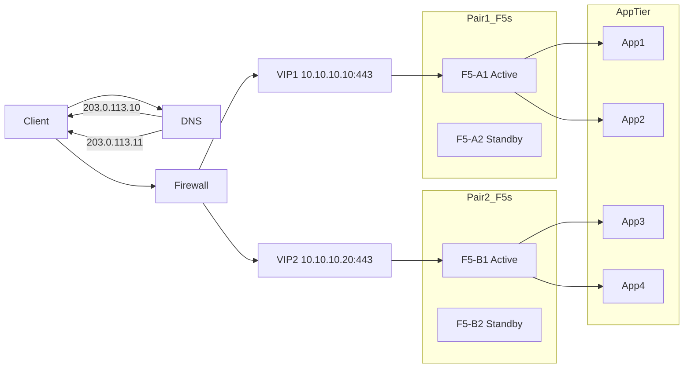

```mermaid
flowchart LR

    Client --> DNS[DNS]
    DNS -->|203.0.113.10| Client
    DNS -->|203.0.113.11| Client

    Client --> FW[Firewall]

    FW --> VIP1[VIP1 10.10.10.10:443]
    FW --> VIP2[VIP2 10.10.10.20:443]

    subgraph Pair1_F5s
        A1[F5-A1 Active]
        A2[F5-A2 Standby]
    end

    subgraph Pair2_F5s
        B1[F5-B1 Active]
        B2[F5-B2 Standby]
    end

    VIP1 --> A1
    VIP2 --> B1

    subgraph AppTier
        APP1[App1]
        APP2[App2]
        APP3[App3]
        APP4[App4]
    end

    A1 --> APP1
    A1 --> APP2
    B1 --> APP3
    B1 --> APP4
```
