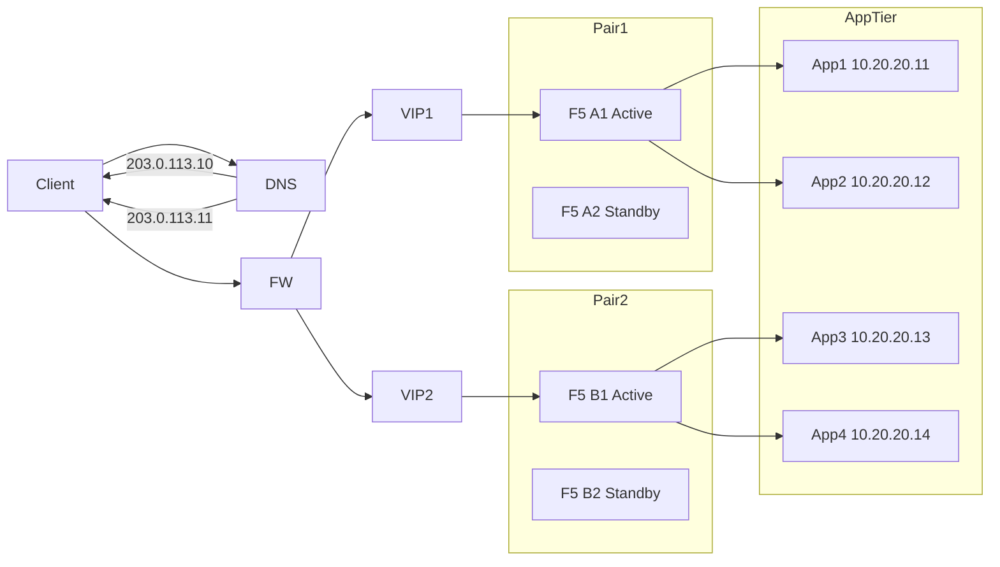

```mermaid
flowchart LR

    Client --> DNS
    DNS -->|203.0.113.10| Client
    DNS -->|203.0.113.11| Client

    Client --> FW

    FW --> VIP1
    FW --> VIP2

    subgraph Pair1
        A1[F5 A1 Active]
        A2[F5 A2 Standby]
    end

    subgraph Pair2
        B1[F5 B1 Active]
        B2[F5 B2 Standby]
    end

    VIP1 --> A1
    VIP2 --> B1

    subgraph AppTier
        APP1[App1 10.20.20.11]
        APP2[App2 10.20.20.12]
        APP3[App3 10.20.20.13]
        APP4[App4 10.20.20.14]
    end

    A1 --> APP1
    A1 --> APP2

    B1 --> APP3
    B1 --> APP4
```
