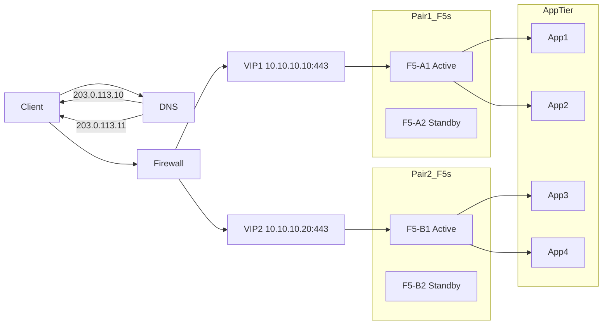

```mermaid
flowchart LR

    Client --> DNS[DNS/GSLB]
    DNS -->|203.0.113.10 (DC1)| Client
    DNS -->|198.51.100.10 (DC2)| Client

    Client --> FW1[Firewall DC1]
    Client --> FW2[Firewall DC2]

    FW1 --> VIP1[DC1 VIP 10.10.10.10:443]
    FW2 --> VIP2[DC2 VIP 10.30.30.10:443]

    subgraph DC1
        A1[F5-A1 Active]
        A2[F5-A2 Standby]
        VIP1 --> A1
        APP1_DC1[App1 DC1]
        APP2_DC1[App2 DC1]
        A1 --> APP1_DC1
        A1 --> APP2_DC1
    end

    subgraph DC2
        B1[F5-B1 Active]
        B2[F5-B2 Standby]
        VIP2 --> B1
        APP1_DC2[App1 DC2]
        APP2_DC2[App2 DC2]
        B1 --> APP1_DC2
        B1 --> APP2_DC2
    end
```
