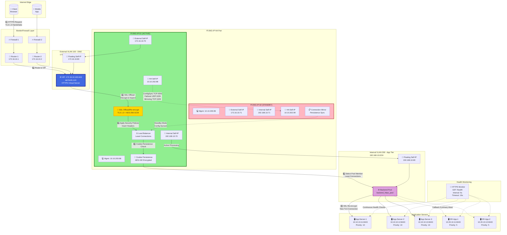

```mermaid
graph TB
    subgraph Internet["Internet Edge"]
        Client1[("👤 Client<br/>Browser")]
        Client2[("👤 Mobile<br/>App")]
    end
    
    subgraph Border["Border/Firewall Layer"]
        FW1["🔥 Firewall-1"]
        FW2["🔥 Firewall-2"]
        Router1["🔀 Router-1<br/>172.16.10.1"]
        Router2["🔀 Router-2<br/>172.16.10.2"]
    end
    
    subgraph External["External VLAN 100 - DMZ<br/>172.16.10.0/24"]
        VIP1["🌐 VIP: 172.16.10.100:443<br/>api.bank.com<br/>HTTPS Virtual Server"]
        FloatExt["📍 Floating Self-IP<br/>172.16.10.80"]
    end
    
    subgraph F5_HA["F5 BIG-IP HA Pair"]
        subgraph F5_Device1["F5 BIG-IP-01 (ACTIVE)"]
            F5A_Mgmt["💻 Mgmt: 10.10.200.98"]
            F5A_Ext["🔌 External Self-IP<br/>172.16.10.70"]
            F5A_Int["🔌 Internal Self-IP<br/>192.168.10.70"]
            F5A_HA["🔌 HA Self-IP<br/>10.10.202.98"]
            F5A_SSL["🔐 SSL Offload/Re-encrypt<br/>TLS 1.3 + AES-256-GCM"]
            F5A_LB["⚖️ Load Balancer<br/>Least Connections"]
            F5A_Persist["🍪 Cookie Persistence<br/>AES-192 Encrypted"]
        end
        
        subgraph F5_Device2["F5 BIG-IP-02 (STANDBY)"]
            F5B_Mgmt["💻 Mgmt: 10.10.200.99"]
            F5B_Ext["🔌 External Self-IP<br/>172.16.10.71"]
            F5B_Int["🔌 Internal Self-IP<br/>192.168.10.71"]
            F5B_HA["🔌 HA Self-IP<br/>10.10.202.99"]
            F5B_Mirror["📋 Connection Mirror<br/>Persistence Sync"]
        end
        
        F5A_HA -.->|"ConfigSync TCP:4353<br/>Failover UDP:1026<br/>Mirroring TCP:1029"| F5B_HA
    end
    
    subgraph Internal["Internal VLAN 200 - App Tier<br/>192.168.10.0/24"]
        FloatInt["📍 Floating Self-IP<br/>192.168.10.80"]
        Pool["⚙️ Backend Pool<br/>backend_https_pool"]
    end
    
    subgraph AppServers["Application Servers"]
        App1["🖥️ App-Server-1<br/>10.10.10.11:8443<br/>Priority: 10"]
        App2["🖥️ App-Server-2<br/>10.10.10.12:8443<br/>Priority: 10"]
        App3["🖥️ App-Server-3<br/>10.10.10.13:8443<br/>Priority: 10"]
        AppDR1["🖥️ DR-App-1<br/>10.20.10.11:8443<br/>Priority: 5"]
        AppDR2["🖥️ DR-App-2<br/>10.20.10.12:8443<br/>Priority: 5"]
    end
    
    subgraph HealthMon["Health Monitoring"]
        Monitor["🏥 HTTPS Monitor<br/>GET /health<br/>Interval: 5s<br/>Timeout: 16s"]
    end
    
    Client1 -->|"1️⃣ HTTPS Request<br/>TLS 1.3 Handshake"| FW1
    Client2 --> FW2
    FW1 --> Router1
    FW2 --> Router2
    Router1 -->|"2️⃣ Route to VIP"| VIP1
    Router2 --> VIP1
    
    VIP1 -->|"3️⃣ SSL Offload<br/>Decrypt & Inspect"| F5A_SSL
    F5A_SSL -->|"4️⃣ Apply Security Policies<br/>Insert Headers"| F5A_LB
    F5A_LB -->|"5️⃣ Cookie Persistence Check"| F5A_Persist
    F5A_Persist -->|"6️⃣ Select Pool Member<br/>Least Connections"| Pool
    
    Pool -->|"7️⃣ SSL Re-encrypt<br/>New TLS Connection"| App1
    Pool --> App2
    Pool --> App3
    Pool -.->|"Fallback if primary down"| AppDR1
    Pool -.-> AppDR2
    
    Monitor -.->|"Continuous Health Checks"| App1
    Monitor -.-> App2
    Monitor -.-> App3
    Monitor -.-> AppDR1
    Monitor -.-> AppDR2
    
    F5A_Int -->|"Active Processing"| FloatInt
    F5A_Ext --> FloatExt
    FloatInt --> Pool
    FloatExt --> VIP1
    
    F5B_Mirror -.->|"Standby Mode<br/>Config Synced"| F5A_LB
    
    style F5_Device1 fill:#90EE90,stroke:#006400,stroke-width:3px
    style F5_Device2 fill:#FFB6C1,stroke:#8B0000,stroke-width:2px
    style VIP1 fill:#4169E1,stroke:#000080,stroke-width:3px,color:#FFF
    style F5A_SSL fill:#FFD700,stroke:#FF8C00,stroke-width:2px
    style Pool fill:#DDA0DD,stroke:#8B008B,stroke-width:2px

```
