# F5 BIG-IP LTM High Availability Architecture Diagrams

## Single Datacenter Active-Standby HA Architecture


## Multi-Datacenter Active-Active with DNS GSLB

```mermaid
graph TB
    subgraph Global["Global Internet"]
        User1["👤 User<br/>North America"]
        User2["👤 User<br/>Europe"]
        User3["👤 User<br/>Asia"]
    end
    
    subgraph DNS_Layer["F5 BIG-IP DNS (GSLB) Layer"]
        DNS1["🌍 DNS-1 East<br/>ns1.bank.com"]
        DNS2["🌍 DNS-2 West<br/>ns2.bank.com"]
        DNS3["🌍 DNS-3 Europe<br/>ns3.bank.com"]
        
        DNS1 <-.->|"iQuery TCP:4353<br/>Encrypted Sync"| DNS2
        DNS2 <-.-> DNS3
        DNS3 <-.-> DNS1
    end
    
    subgraph DC_East["🏢 Primary Datacenter - East (Ashburn)<br/>Active Site"]
        subgraph F5_East["F5 HA Pair - East"]
            F5E1["⚡ F5-East-01<br/>ACTIVE<br/>VIP: 172.16.10.100"]
            F5E2["💤 F5-East-02<br/>STANDBY"]
            F5E1 -.->|"HA Sync"| F5E2
        end
        
        subgraph Apps_East["Application Tier"]
            AppE1["🖥️ App-East-1"]
            AppE2["🖥️ App-East-2"]
            AppE3["🖥️ App-East-3"]
        end
        
        subgraph Data_East["Data Tier"]
            DB_East["🗄️ Database<br/>Primary"]
            Redis_East["📦 Redis<br/>Session Store"]
        end
        
        F5E1 --> AppE1 & AppE2 & AppE3
        AppE1 & AppE2 & AppE3 --> DB_East
        AppE1 & AppE2 & AppE3 --> Redis_East
    end
    
    subgraph DC_West["🏢 DR Datacenter - West (San Francisco)<br/>Active Site"]
        subgraph F5_West["F5 HA Pair - West"]
            F5W1["⚡ F5-West-01<br/>ACTIVE<br/>VIP: 10.20.10.100"]
            F5W2["💤 F5-West-02<br/>STANDBY"]
            F5W1 -.-> F5W2
        end
        
        subgraph Apps_West["Application Tier"]
            AppW1["🖥️ App-West-1"]
            AppW2["🖥️ App-West-2"]
            AppW3["🖥️ App-West-3"]
        end
        
        subgraph Data_West["Data Tier"]
            DB_West["🗄️ Database<br/>Replica"]
            Redis_West["📦 Redis<br/>Session Store"]
        end
        
        F5W1 --> AppW1 & AppW2 & AppW3
        AppW1 & AppW2 & AppW3 --> DB_West
        AppW1 & AppW2 & AppW3 --> Redis_West
    end
    
    subgraph DC_Europe["🏢 Edge Datacenter - Europe (London)<br/>Active Site"]
        subgraph F5_EU["F5 HA Pair - Europe"]
            F5EU1["⚡ F5-EU-01<br/>ACTIVE<br/>VIP: 10.30.10.100"]
            F5EU2["💤 F5-EU-02<br/>STANDBY"]
            F5EU1 -.-> F5EU2
        end
        
        subgraph Apps_EU["Application Tier"]
            AppEU1["🖥️ App-EU-1"]
            AppEU2["🖥️ App-EU-2"]
        end
        
        subgraph Data_EU["Data Tier"]
            DB_EU["🗄️ Database<br/>Replica"]
            Redis_EU["📦 Redis<br/>Session Store"]
        end
        
        F5EU1 --> AppEU1 & AppEU2
        AppEU1 & AppEU2 --> DB_EU
        AppEU1 & AppEU2 --> Redis_EU
    end
    
    subgraph Management["🔧 Central Management"]
        BIGIQ["☁️ F5 BIG-IQ<br/>Centralized Config<br/>& Licensing"]
        SIEM["📊 SIEM/Logging<br/>Splunk/ELK"]
        Monitoring["📈 Monitoring<br/>Prometheus/Grafana"]
    end
    
    User1 -->|"1️⃣ DNS Query<br/>api.bank.com"| DNS1
    User2 --> DNS2
    User3 --> DNS3
    
    DNS1 -->|"2️⃣ Topology Routing<br/>172.16.10.100"| User1
    DNS2 -->|"2️⃣ Geographic<br/>10.30.10.100"| User2
    DNS3 -->|"2️⃣ Proximity<br/>10.20.10.100"| User3
    
    User1 -->|"3️⃣ HTTPS to VIP"| F5E1
    User2 --> F5EU1
    User3 --> F5W1
    
    DB_East <-.->|"Replication"| DB_West
    DB_West <-.-> DB_EU
    DB_EU <-.-> DB_East
    
    Redis_East <-.->|"Session Sync"| Redis_West
    Redis_West <-.-> Redis_EU
    Redis_EU <-.-> Redis_East
    
    BIGIQ -.->|"Config Push"| F5E1 & F5W1 & F5EU1
    
    F5E1 & F5W1 & F5EU1 -->|"HSL Logging"| SIEM
    F5E1 & F5W1 & F5EU1 -->|"SNMP/Metrics"| Monitoring
    
    DNS1 <-.->|"Health Monitoring<br/>iQuery"| F5E1
    DNS2 <-.-> F5W1
    DNS3 <-.-> F5EU1
    
    style DC_East fill:#E8F5E9,stroke:#4CAF50,stroke-width:3px
    style DC_West fill:#FFF3E0,stroke:#FF9800,stroke-width:3px
    style DC_Europe fill:#E3F2FD,stroke:#2196F3,stroke-width:3px
    style DNS_Layer fill:#F3E5F5,stroke:#9C27B0,stroke-width:3px
    style F5E1 fill:#90EE90,stroke:#006400,stroke-width:3px
    style F5W1 fill:#90EE90,stroke:#006400,stroke-width:3px
    style F5EU1 fill:#90EE90,stroke:#006400,stroke-width:3px
```



## SSL/TLS Traffic Flow: End-to-End Encryption


## Failover Sequence: Active to Standby Transition


## Horizontal Scaling with ECMP

```mermaid
graph TB
    subgraph Internet["Internet / WAN"]
        Clients["👥 Clients<br/>api.bank.com"]
    end
    
    subgraph Core_Routers["Core Network - ECMP Enabled"]
        Router1["🔀 Core Router-1<br/>BGP AS 65000<br/>ECMP Max-Paths: 8"]
        Router2["🔀 Core Router-2<br/>BGP AS 65000<br/>ECMP Max-Paths: 8"]
        
        Router1 <-.->|"iBGP Peering"| Router2
    end
    
    subgraph ECMP_VIP["Advertised VIP Route<br/>172.16.10.100/32"]
        VIP_Route["📍 Equal-Cost Multi-Path<br/>8 Active Paths to VIP"]
    end
    
    subgraph Pair1["F5 HA Pair 1 (Primary)"]
        F5_1A["⚡ F5-01A ACTIVE<br/>BGP AS 65001<br/>Advertises 172.16.10.100/32"]
        F5_1B["💤 F5-01B STANDBY"]
        F5_1A <-.->|"HA Sync"| F5_1B
        F5_1A -->|"eBGP Peer<br/>Route: 172.16.10.100/32"| Router1
        F5_1A --> Router2
    end
    
    subgraph Pair2["F5 HA Pair 2"]
        F5_2A["⚡ F5-02A ACTIVE<br/>BGP AS 65002<br/>Advertises 172.16.10.100/32"]
        F5_2B["💤 F5-02B STANDBY"]
        F5_2A <-.-> F5_2B
        F5_2A --> Router1
        F5_2A --> Router2
    end
    
    subgraph Pair3["F5 HA Pair 3"]
        F5_3A["⚡ F5-03A ACTIVE<br/>BGP AS 65003<br/>Advertises 172.16.10.100/32"]
        F5_3B["💤 F5-03B STANDBY"]
        F5_3A <-.-> F5_3B
        F5_3A --> Router1
        F5_3A --> Router2
    end
    
    subgraph Pair4["F5 HA Pair 4"]
        F5_4A["⚡ F5-04A ACTIVE<br/>BGP AS 65004<br/>Advertises 172.16.10.100/32"]
        F5_4B["💤 F5-04B STANDBY"]
        F5_4A <-.-> F5_4B
        F5_4A --> Router1
        F5_4A --> Router2
    end
    
    subgraph Backend["Backend Application Pool"]
        AppPool["🖥️🖥️🖥️ Application Servers<br/>Shared by all F5 pairs"]
    end
    
    Clients -->|"1️⃣ Traffic to VIP"| Router1
    Clients --> Router2
    
    Router1 -->|"2️⃣ ECMP Hash<br/>5-tuple: SrcIP, DstIP<br/>SrcPort, DstPort, Proto"| VIP_Route
    Router2 --> VIP_Route
    
    VIP_Route -->|"3️⃣ Path 1<br/>~25% Traffic"| F5_1A
    VIP_Route -->|"3️⃣ Path 2<br/>~25% Traffic"| F5_2A
    VIP_Route -->|"3️⃣ Path 3<br/>~25% Traffic"| F5_3A
    VIP_Route -->|"3️⃣ Path 4<br/>~25% Traffic"| F5_4A
    
    F5_1A -->|"4️⃣ Load Balance"| AppPool
    F5_2A --> AppPool
    F5_3A --> AppPool
    F5_4A --> AppPool
    
    subgraph Monitoring["Health Monitoring"]
        BFD1["⚡ BFD to Pair 1<br/>Interval: 50ms"]
        BFD2["⚡ BFD to Pair 2<br/>Interval: 50ms"]
        BFD3["⚡ BFD to Pair 3<br/>Interval: 50ms"]
        BFD4["⚡ BFD to Pair 4<br/>Interval: 50ms"]
    end
    
    Router1 -.->|"BFD Monitor"| BFD1
    Router1 -.-> BFD2
    Router1 -.-> BFD3
    Router1 -.-> BFD4
    
    BFD1 -.-> F5_1A
    BFD2 -.-> F5_2A
    BFD3 -.-> F5_3A
    BFD4 -.-> F5_4A
    
    subgraph Capacity["Capacity & Scaling"]
        Cap1["📊 Total Capacity:<br/>4 pairs × 20 Gbps = 80 Gbps"]
        Cap2["📈 Effective Capacity:<br/>60 Gbps (N+1 redundancy)"]
        Cap3["➕ Scale Out:<br/>Add pairs incrementally<br/>No downtime required"]
    end
    
    style VIP_Route fill:#4169E1,stroke:#000080,stroke-width:3px,color:#FFF
    style F5_1A fill:#90EE90,stroke:#006400,stroke-width:2px
    style F5_2A fill:#90EE90,stroke:#006400,stroke-width:2px
    style F5_3A fill:#90EE90,stroke:#006400,stroke-width:2px
    style F5_4A fill:#90EE90,stroke:#006400,stroke-width:2px
    style AppPool fill:#DDA0DD,stroke:#8B008B,stroke-width:2px
```



## Complete Network Topology with VLANs


---

## Usage Instructions

### Rendering in GitHub README.md

1. Copy any of the Mermaid diagrams above
2. Paste directly into your `README.md` file
3. GitHub will automatically render the diagrams

### Example README Structure

```markdown
# F5 BIG-IP LTM Architecture

## Architecture Overview
Our enterprise F5 deployment uses active-standby HA pairs...

## Network Diagram
[Include Single Datacenter diagram here]

## Multi-Site Design  
[Include Multi-Datacenter diagram here]

## SSL Traffic Flow
[Include SSL/TLS sequence diagram here]
```

### Diagram Capabilities

- ✅ **Fully GitHub Compatible** - All diagrams use Mermaid syntax supported by GitHub's native renderer
- ✅ **Interactive** - Readers can zoom and pan on complex diagrams
- ✅ **Version Controlled** - Diagrams are text-based, perfect for Git diffs
- ✅ **No External Dependencies** - No need for separate image files
- ✅ **Easy Updates** - Modify diagram code to update architecture

### Customization Tips

1. **Change Colors**: Modify `style` statements at the bottom of diagrams
2. **Add Components**: Insert new subgraphs or nodes using existing syntax patterns
3. **Adjust Layout**: Change `TB` (top-bottom) to `LR` (left-right) for horizontal layouts
4. **Add Details**: Include additional labels, ports, or IP addresses as needed

### Testing Diagrams

Before committing, test your diagrams at:
- [Mermaid Live Editor](https://mermaid.live)
- Preview in VS Code with Mermaid extension
- GitHub's preview tab

---

## Diagram Legend

| Symbol | Meaning |
|--------|---------|
| ⚡ | Active Device |
| 💤 | Standby Device |
| 🌐 | Virtual IP (VIP) |
| 📍 | IP Address |
| 🔐 | SSL/Encryption |
| ⚖️ | Load Balancer |
| 🖥️ | Server |
| 🗄️ | Database |
| 📦 | Cache/Session Store |
| 🔀 | Router/Switch |
| 🔥 | Firewall |
| 👤 | End User |
| 🏥 | Health Monitor |
| ☁️ | Management System |
| 📊 | Monitoring/Logging |

---

## Version History

- **v1.0** - Initial architecture diagrams
- **v1.1** - Added ECMP scaling diagram
- **v1.2** - Enhanced VLAN topology with security zones
- **v1.3** - Added detailed SSL traffic flow sequence
